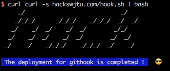

# Hackswjtu - Githook


```
     _/                            _/
    _/_/_/      _/_/_/    _/_/_/  _/  _/
   _/    _/  _/    _/  _/        _/_/
  _/    _/  _/    _/  _/        _/  _/
 _/    _/    _/_/_/    _/_/_/  _/    _/
```

## 描述

Hackswjtu 自用 Githook。在进行 `git commit` 操作时，向指定的成员发送邮件，描述本次修改时当前条记录的 `git log -p` 信息，便捷快速的进行 *Coding Review*。

## 配置方法

### macOS & Linux

在拥有 *git* 功能的项目目录中（即含有 `.git` 目录），执行安装命令：

```bash
$ curl -s hackswjtu.com/hook.sh | bash
```

按照提示输入 `sudo` 密码，看到以下图样完成 hook 配置。该脚本由于需要在 `.git/hooks/` 中增添文件，需要获取文件的读写权限，故需要 `sudo` 密码校验。



## 使用方法

当执行 `git commit` 命令时，在 `-m` 参数尾部加上 ` xxoo:[email id]` 参数（切记 `xxoo` 前面有一个空格），即可立即对 `[email id]@hackswjtu.com` 发送一份提交的 `diff` 日志邮件。例如 *冬瓜* 完成了某一需求的代码并交与 *Andy* 进行 *Coding Review* 则可键入一下命令：

```bash
$ git commit -m 'Do you have something tonight? xxoo:andy'
```

commit 提交之后，Andy 的邮箱（`andy@hackswjtu.com`）将会收到一封邮件，即本次提交的所有改动日志。

## MIT License

Copyright (c) 2017 Hack Swjtu

Permission is hereby granted, free of charge, to any person obtaining a copy
of this software and associated documentation files (the "Software"), to deal
in the Software without restriction, including without limitation the rights
to use, copy, modify, merge, publish, distribute, sublicense, and/or sell
copies of the Software, and to permit persons to whom the Software is
furnished to do so, subject to the following conditions:

The above copyright notice and this permission notice shall be included in all
copies or substantial portions of the Software.


